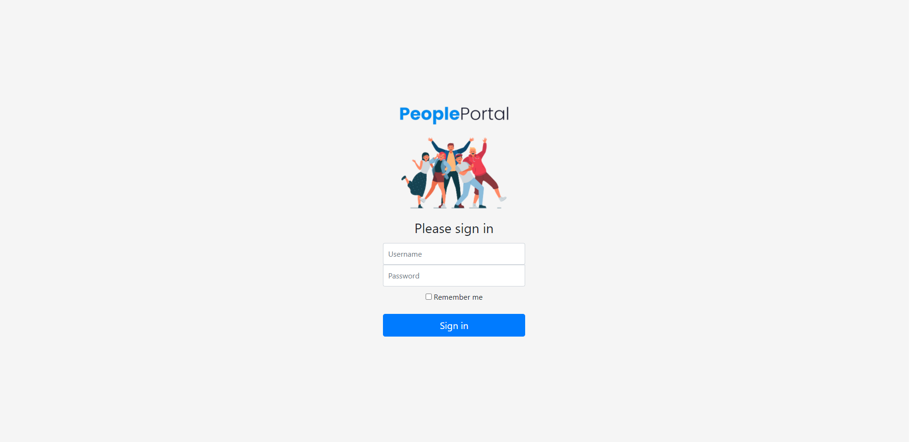
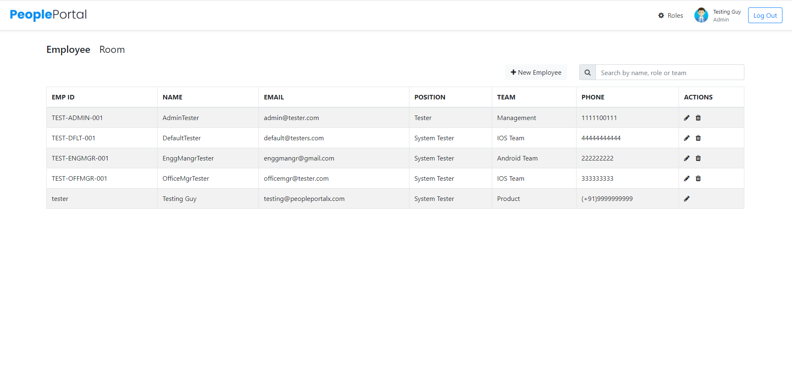
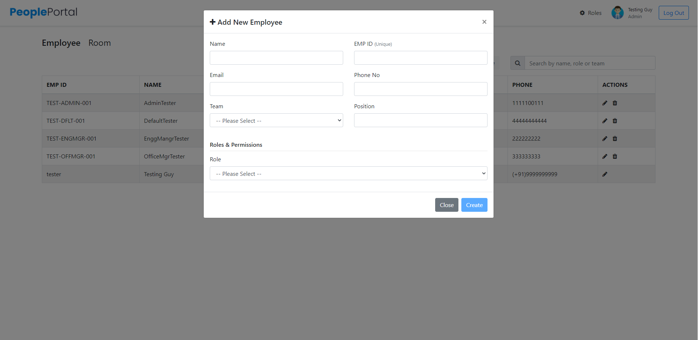
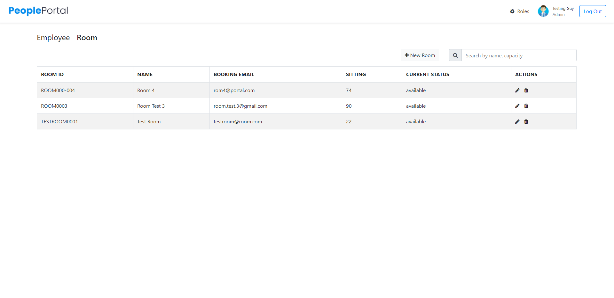
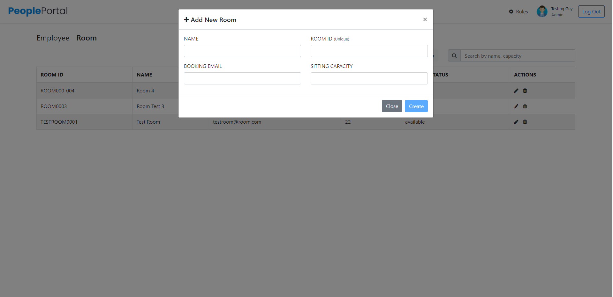

# BlueStacks - PeoplePortal


Submission for BlueStacks position [Senior Member of Technical Staff (SMTS)](https://github.com/bluestacks/senior-backend-developer-assignment-adv)

## Technology Stack
- **Web Framework**: Python-Django
- **Backend**: PostgreSQL
- **Frontend**: Bootstrap, AngularJs, JQuery


## Design
### RBAC(Role Based access control system) implementation
- [peopleportal/management/commands/initialize_system.py](peopleportal/management/commands/initialize_system.py)
- [peopleportal/middlewares.py](peopleportal/middlewares.py)
- [peopleportal/decorators.py](peopleportal/decorators.py)


### RBAC usage
- Backend
    - [accounts/views.py](accounts/views.py)
    - [conference/views.py](conference/views.py)
- Frontend
    -  [templates/console.html](templates/console.html)
    
    
## Installation Instructions
- Create virtual environment
- Activate virtual environment
- Clone project
- Install project dependencies ([requirements.txt](requirements.txt))
    ```cmd
    pip install -r requirements.txt
    ```
- Edit database settings in `settings.py`
- Run database migrations:
    ```cmd
    python manage.py makemigrations
    python manage.py migrate
    ```
- Create superuser
    ```cmd
    python manage.py createsuperuser
    ```
- Initialize System (**Important**)
    ```cmd
    python manage.py initialize_system
    ```
- Run server:
    ```cmd
    python manage.py runserver
    ```
- Open any browser and go to [http://127.0.0.1:8000/](http://127.0.0.1:8000/)


## Screenshots

|    |   |
|---|---|
|    |   |
|   |   |
|   |   |


## Change Log

- 2021-05-31
  - `peopleportal/passwords.json` deprecated.
  - Created `peopleportal/settings_common.py` to store all common configurations.
  - `peopleportal/setting.py` now contains only deployment specific configurations like db credentials, etc.
  - Removed `peopleportal/settings.py`. This should be manually created using `peopleportal/settings_template.py`.
    


## Submitted By
- Name: Gagandeep Singh
- Mobile No: +91 9717568636
- Email: singh.gagan144@gmail.com
- Date: October 2020