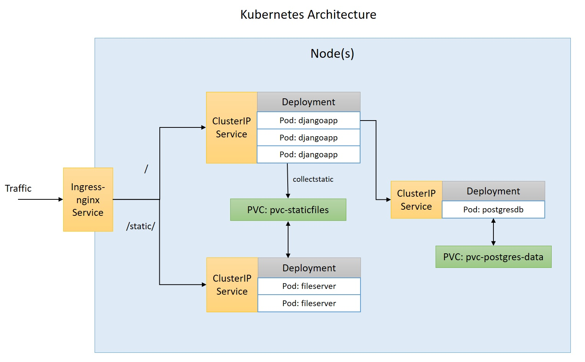

# PeoplePortal

This project is a playground for developing django web application and deploying it on cloud using Heroku, AWS, GCP, Docker, Kubernetes, etc.

Earlier, this project was submitted as an assignment for the BlueStacks position [Senior Member of Technical Staff (SMTS)](https://github.com/bluestacks/senior-backend-developer-assignment-adv). 
Now, this project is used for experimenting with new technologies.

## Technology Stack
- **Web Framework**: Python-Django
- **Backend**: PostgreSQL
- **Frontend**: Bootstrap, AngularJs, JQuery
- **DevOps**: AWS/Heroku/Docker/Kubernetes


## Application
### RBAC(Role Based access control system) implementation
- [peopleportal/management/commands/initialize_system.py](peopleportal/management/commands/initialize_system.py)
- [peopleportal/middlewares.py](peopleportal/middlewares.py)
- [peopleportal/decorators.py](peopleportal/decorators.py)


### RBAC usage
- Backend
    - [accounts/views.py](accounts/views.py)
    - [conference/views.py](conference/views.py)
- Frontend
    - [templates/console.html](templates/console.html)
    

## Installation

### 1. Manual Installation Instructions
- Create virtual environment
- Activate virtual environment
- Clone project
- Install project dependencies ([requirements.txt](requirements.txt))
    ```cmd
    pip install -r requirements.txt
    ```
- Create `settings.py` in `peopleportal` directory using the template `settings__template__.py`.
  Edit all database and other settings variable.
  
- Apply database migrations:
    ```cmd
    python manage.py migrate
    ```
- Create superuser
    ```cmd
    python manage.py createsuperuser
    ```
- Initialize System (**Important**)
    ```cmd
    python manage.py initialize_system
    ```
- Run server:
    ```cmd
    python manage.py runserver
    ```
- Open any browser and go to [http://127.0.0.1:8000/](http://127.0.0.1:8000/) or open [http://127.0.0.1:8000/admin/](http://127.0.0.1:8000/admin/) to configure system.


### 2. Docker

#### 2.1 Manually build docker images:
- Django application:
    ```cmd
    docker build -t gagan144/peopleportal-djangoapp .
    docker push gagan144/peopleportal-djangoapp
    ```
- File server for kubernetes deployment:
    <br/>This container image is used to deploy static file behind ingress-nginx in a kubernetes cluster. This is not used in docker-compose setup. 
    ```cmd
    docker build -t gagan144/peopleportal-fileserver ./dockers/fileserver-k8s
    docker push gagan144/peopleportal-fileserver
    ```

**Docker Hub Link**: https://hub.docker.com/r/gagan144/peopleportal-djangoapp


#### 2.2 Run containers using 'docker-compose':
- Refer `docker-compose.yml`, `Dockerfile`, directory `dockers/`, `peopleportal/_settings_docker.py` file for better understanding.
- Build images and run containers:
    <br/>Inside the project directory, run the following command
    ```cmd
    docker-compose up --build
    ```
    
    
- Default django admin credentials:
    <br/>URL: [http://localhost:9000/admin](http://localhost:9000/admin)
    <br/>Username: admin
    <br/>Password: admin
    
### 3. Kubernetes
All kubernetes yaml files are place inside [k8s](k8s) directory. The architecture is as follows:



- **Setup**:
    - (If using minikube) Enable minikube ingress add-on:
        ```cmd
        minikube addons enable ingress
        ```
    - Create a k8s Secret:
        ```cmd
        kubectl create secret generic secret-peopleportal --from-literal PG_PASSWORD=pgrootpass
        ```

- **Deploy**: To deploy the project inside kubernetes cluster, use the following command:
    ```cmd
    kubectl apply -f k8s
    ```


## Screenshots

|    |   |
|---|---|
|    |   |
|   |   |
|   |   |


## Change Logs

- 2021-05-31
  - `peopleportal/passwords.json` deprecated.
  - Created `peopleportal/settings_common.py` to store all common configurations.
  - `peopleportal/setting.py` now contains only deployment specific configurations like db credentials, etc.
  - Removed `peopleportal/settings.py`. This should be manually created using `peopleportal/settings__template__.py`.
  - Docker deployment


## Submitted By
- Name: Gagandeep Singh
- Email: singh.gagan144@gmail.com
- Submitted on: October 2020